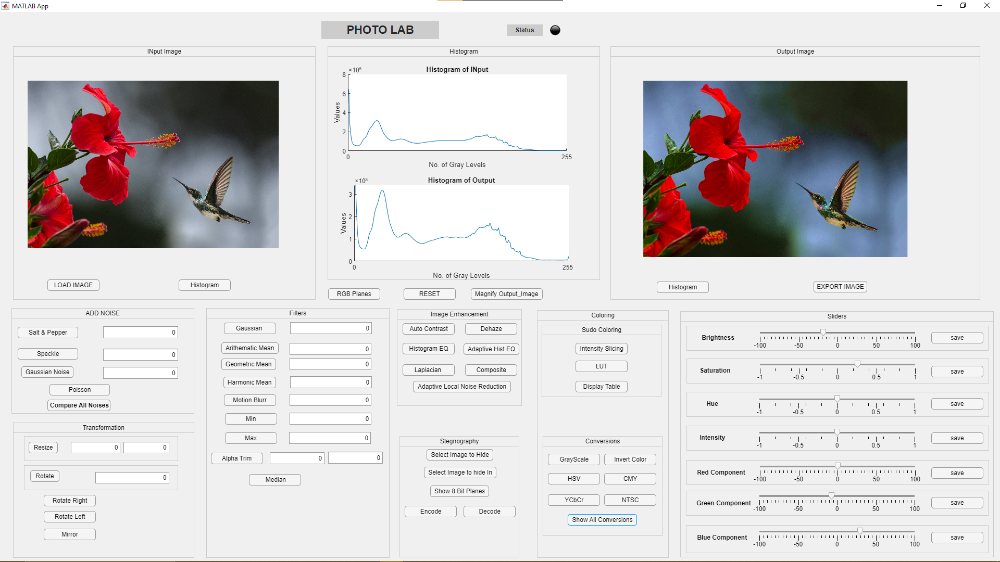

# PHOTO-LAB

PHOTO-LAB is a MATLAB software application designed to facilitate users to perform various image processing operations. With PHOTO-LAB, users can apply different filters to images, perform image enhancement, steganography, color operations, and image transformations. Additionally, the software provides features to adjust different basic things like hue, saturation, brightness, and more. Users can also view RGB planes and histograms of images using this software.

## Installation

To install PHOTO-LAB, follow these steps:
1. Clone this repository.
2. Install MATLAB on your system.
3. Open the `photo_lab.mlapp` file in MATLAB.
4. Run the application in MATLAB.

You can use the MATLAB Compiler to convert your MATLAB code into standalone applications or software components. This allows you to distribute your MATLAB applications to users who do not have MATLAB installed on their computers.

To use the MATLAB Compiler, you need to follow these steps:

1. Open MATLAB and navigate to the "Apps" tab.
2. Click on the "MATLAB Compiler" button.
3. In the "MATLAB Compiler" window, click on the "Package" button.
4. Select the MATLAB code you want to package into a standalone application.
5. Choose the options you want for your application, such as the name, version, and output directory.
6. Click on the "Package" button to package your MATLAB code into a standalone application.

Once you have created the standalone application, you can distribute it to users who do not have MATLAB installed on their computers. The users can then run the application without needing to have MATLAB installed.

Note that the MATLAB Compiler requires a license and is only available in certain versions of MATLAB. You can check if the MATLAB Compiler is available in your version of MATLAB by checking the MATLAB documentation or contacting MathWorks support.

## Usage

To use PHOTO-LAB, follow these steps:
1. Open the `photo_lab.mlapp` file in MATLAB.
2. Choose an image to work on.
3. Select the desired image processing operation from the menu on the left.
4. Adjust the parameters for the selected operation.
5. Click the "Process Image" button to apply the selected operation to the image.
6. Save the processed image.

## Contributing

Contributions to PHOTO-LAB are welcome! To contribute, please follow these steps:
1. Fork this repository.
2. Create a new branch with your proposed changes.
3. Make your changes and commit them.
4. Submit a pull request to this repository.

## License

This project is licensed under the GNU General Public License v3.0. See the [LICENSE](LICENSE) file for details.

## Contributors

The following individuals have contributed to the development of PHOTO-LAB:
- Abdullah (abdullahx124@gmail.com)
- Muhammad Awais (awaisramazan7297@gmail.com)
